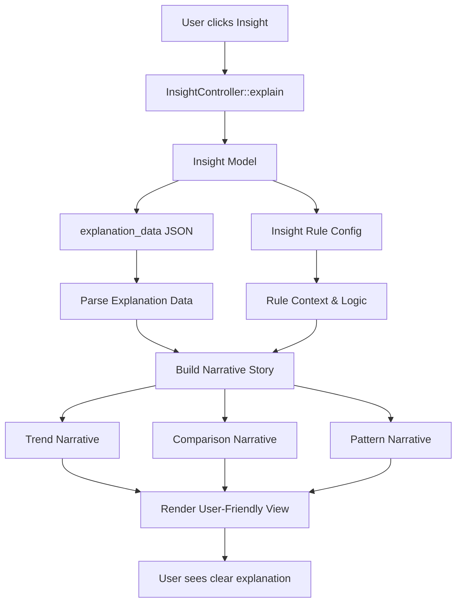

# Insight Explanation Redesign - Implementation Plan

## System Overview

The insight explanation system needs to transform technical data into a clear, narrative explanation that helps users understand WHY they received a specific insight. Currently, the system shows raw data (averages, comparisons) without connecting it to the insight message in a user-friendly way.

## Data Flow Diagram



## Component Table

| Component | Responsibility | Inputs | Outputs |
|-----------|---------------|--------|---------|
| `InsightExplanationService` | Transform technical data into user-friendly narratives | `Insight` model, `explanation_data` | Structured explanation with story, data summary, actionable insights |
| `ExplanationStoryBuilder` | Build narrative explanations for different insight types | Insight type, explanation data | Human-readable story text |
| `ExplanationViewRenderer` | Render the explanation in Blade template | Structured explanation data | HTML view |
| `InsightController::explain` | Orchestrate explanation generation | `Insight $insight` | View with explanation data |

## Data Models

### Current Structure
```php
Insight {
    explanation_data: {
        rule_code: string,
        data_used: {
            trend?: { direction, 3d_avg, 7d_avg, days },
            comparison?: { baseline, current_avg, baseline_avg },
            pattern?: { pattern, night_avg, day_avg }
        }
    }
}
```

### New Structure (Enhanced)
```php
StructuredExplanation {
    insight_summary: {
        message: string,
        type: string,
        priority: string,
        created_at: Carbon
    },
    story: {
        headline: string,        // "Tại sao bạn thấy insight này?"
        narrative: string,        // Human-readable explanation
        key_facts: array,         // Bullet points of important data
    },
    data_summary: {
        time_period: string,      // "3 ngày gần đây"
        main_comparison: string,  // "Cao hơn 1.6 điểm so với tuần trước"
        supporting_data: array
    },
    actionable_insights: array,   // What user should do
    technical_details: {           // Collapsed section for power users
        raw_data: array,
        calculation_method: string
    }
}
```

## Step-by-Step Implementation Plan

### Step 1: Create InsightExplanationService
**File**: `app/Services/InsightExplanationService.php`

**Responsibilities**:
- Parse `explanation_data` from Insight model
- Build narrative stories based on insight type
- Format data summaries in user-friendly language
- Generate actionable insights

**Key Methods**:
- `buildExplanation(Insight $insight): array` - Main entry point
- `buildTrendStory(array $data): array` - For TREND insights
- `buildComparisonStory(array $data): array` - For COMPARISON insights
- `buildPatternStory(array $data): array` - For PATTERN insights
- `formatTimePeriod(Carbon $date): string` - "3 ngày gần đây"
- `formatComparison(float $current, float $baseline, string $baselineType): string` - "Cao hơn 1.6 điểm"

### Step 2: Update InsightController
**File**: `app/Http/Controllers/InsightController.php`

**Changes**:
- Inject `InsightExplanationService`
- Call service in `explain()` method
- Pass structured explanation to view

### Step 3: Redesign Explanation View
**File**: `resources/views/insights/explain.blade.php`

**New Structure**:
1. **Header Section** (unchanged)
2. **Insight Card** (unchanged)
3. **Story Section** (NEW - prominent)
   - Headline: "Tại sao bạn thấy insight này?"
   - Narrative paragraph explaining the insight in simple terms
   - Key facts as bullet points
4. **Data Summary Section** (REDESIGNED)
   - Visual comparison (if applicable)
   - Time period context
   - Main numbers highlighted
5. **What This Means** (NEW)
   - Actionable insights
   - What user should do next
6. **Technical Details** (COLLAPSIBLE)
   - Raw data for power users
   - Calculation method

### Step 4: Add Helper Methods for Formatting
**File**: `app/Services/InsightExplanationService.php`

**Methods**:
- `getTrendDirectionText(string $direction): string` - "Nặng hơn" / "Cải thiện" / "Ổn định"
- `getBaselineText(string $baseline): string` - "Tuần trước" / "Trung bình cá nhân"
- `formatSeverityDifference(float $diff): string` - "Cao hơn 1.6 điểm" / "Thấp hơn 0.8 điểm"
- `getActionableInsights(string $type, array $data): array` - Context-specific actions

### Step 5: Add Narrative Templates
**File**: `app/Services/InsightExplanationService.php` or separate config file

**Templates** (Vietnamese):
- TREND_WORSENING: "Triệu chứng của bạn đã tăng từ {7d_avg}/10 lên {3d_avg}/10 trong 3 ngày gần đây. Đây là xu hướng đáng chú ý."
- COMPARISON_HIGHER: "Mức độ triệu chứng hiện tại ({current_avg}/10) cao hơn {baseline_type} ({baseline_avg}/10) khoảng {difference} điểm."
- PATTERN_NIGHT: "Hệ thống phát hiện triệu chứng của bạn nặng hơn vào ban đêm ({night_avg}/10) so với ban ngày ({day_avg}/10)."

## Implementation Details

### Narrative Story Structure

Each story should answer:
1. **What happened?** - The data/trend detected
2. **Why is this important?** - Context and significance
3. **What should you do?** - Actionable next steps

### Example Transformation

**Before (Technical)**:
```
So sánh
Cơ sở so sánh: Tuần trước
Hiện tại: 1.6/10
Cơ sở: 0/10
```

**After (Narrative)**:
```
Câu chuyện:
Triệu chứng của bạn hiện tại (1.6/10) cao hơn tuần trước (0/10) khoảng 1.6 điểm. 
Đây là sự thay đổi đáng chú ý so với mức ổn định trước đó.

Điều này có nghĩa là:
• Triệu chứng đã xuất hiện hoặc tăng lên trong tuần này
• Nên theo dõi sát diễn biến trong những ngày tới
• Nếu tiếp tục tăng, hãy trao đổi với bác sĩ
```

## Open Questions

1. Should we show visual charts/graphs for trend data? (Future enhancement)
2. Should we allow users to provide feedback on insight accuracy? (Future feature)
3. Do we need different explanation styles for different user types (e.g., medical professionals vs. general users)?

## Success Criteria

- User can understand WHY they got the insight in < 30 seconds
- Explanation uses plain language, not technical jargon
- Data is presented in context, not as raw numbers
- Actionable insights are clear and specific
- Technical details available but not prominent

