# System Mapping: INS_TREND_WORSENING Calculation Mechanism

## Requirement Summary

**INS_TREND_WORSENING** is an insight that detects when a user's health symptoms are worsening over a 3-day period compared to their 7-day average. The system calculates daily composite scores from symptom logs, compares recent trends, and generates a high-priority insight when deterioration is detected.

**Key Requirements:**
- Detect worsening trend over 3+ days
- Compare last 3 days average vs 7-day average
- Threshold: change >= 1.5 points indicates worsening
- Generate high-priority insight with actionable message
- Store insight in database for user viewing

## Codebase Mapping Summary

### Entry Points
- **TimelineController::index()** - Generates insights when user views timeline
- **CheckInService::generateAndSaveInsights()** - Generates insights after check-in submission

### Core Service
- **InsightService::generateInsights()** - Main orchestration method
- **InsightService::aggregateDailyScores()** - Converts symptom logs to daily scores
- **InsightService::calculateTrendFixed()** - Calculates trend using 3d vs 7d comparison
- **InsightService::createInsightFromRule()** - Applies rule configuration to create insight

### Data Models
- **SymptomLog** - Individual symptom severity entries (severity, occurred_at, symptom_code)
- **Symptom** - Symptom definitions (severity_scale, is_critical)
- **Insight** - Generated insights stored in database

### Configuration
- **config/insights.php** - Rule definitions including INS_TREND_WORSENING message and priority

### Formula Details

**Daily Score Calculation:**
```
For each day:
  For each SymptomLog:
    normalizedSeverity = (log.severity / symptom.severity_scale) * 10
    weight = symptom.is_critical ? 2.0 : 1.0
    totalWeightedSeverity += normalizedSeverity * weight
    totalWeight += weight
  
  dailyScore = totalWeightedSeverity / totalWeight
  dailyScore = clamp(dailyScore, 0, 10)
```

**Trend Calculation:**
```
dailyScores = aggregateDailyScores(user, 7 days)
avg3d = average(last 3 days from dailyScores)
avg7d = average(all 7 days from dailyScores)
change = avg3d - avg7d

if change >= 1.5:
  direction = 'worsening'
else if change <= -1.5:
  direction = 'improving'
else:
  direction = 'stable'
```

**Insight Generation Condition:**
```
if trend.direction === 'worsening' AND trend.days >= 3:
  create INS_TREND_WORSENING insight
```

## Mermaid Diagram

```mermaid
flowchart TD
    Start([User Action]) --> Entry1[TimelineController::index]
    Start --> Entry2[CheckInService::generateAndSaveInsights]
    
    Entry1 --> Generate[InsightService::generateInsights]
    Entry2 --> Generate
    
    Generate --> Aggregate[aggregateDailyScores<br/>user, 7 days]
    
    Aggregate --> QueryLogs[Query SymptomLog<br/>last 7 days<br/>with Symptom relation]
    
    QueryLogs --> GroupByDate[Group logs by date]
    
    GroupByDate --> CalcDailyScore{For each day:<br/>Calculate Daily Score}
    
    CalcDailyScore --> Normalize[Normalize each log:<br/>normalizedSeverity =<br/>severity / scale * 10]
    
    Normalize --> Weight[Apply weight:<br/>critical = 2.0<br/>normal = 1.0]
    
    Weight --> WeightedAvg[Calculate weighted average:<br/>sum normalizedSeverity * weight<br/>/ sum weight]
    
    WeightedAvg --> Clamp[Clamp to 0-10 range]
    
    Clamp --> FillMissing[Fill missing dates with 0.0]
    
    FillMissing --> DailyScores[Return dailyScores<br/>array: date => score]
    
    DailyScores --> CalcTrend[calculateTrendFixed]
    
    CalcTrend --> CheckData{Has >= 3 days<br/>of data?}
    
    CheckData -->|No| ReturnStable[Return stable trend]
    CheckData -->|Yes| Calc3dAvg[Calculate 3-day average:<br/>avg3d = avg last 3 days]
    
    Calc3dAvg --> Calc7dAvg[Calculate 7-day average:<br/>avg7d = avg all 7 days]
    
    Calc7dAvg --> CalcChange[Calculate change:<br/>change = avg3d - avg7d]
    
    CalcChange --> CheckThreshold{change >= 1.5?}
    
    CheckThreshold -->|Yes| SetWorsening[Set direction = 'worsening'<br/>days = 3<br/>change = change]
    CheckThreshold -->|No| CheckImproving{change <= -1.5?}
    
    CheckImproving -->|Yes| SetImproving[Set direction = 'improving']
    CheckImproving -->|No| ReturnStable
    
    SetWorsening --> TrendResult[Return trend object]
    SetImproving --> TrendResult
    ReturnStable --> TrendResult
    
    TrendResult --> CheckCondition{trend.direction ===<br/>'worsening' AND<br/>trend.days >= 3?}
    
    CheckCondition -->|No| SkipInsight[Skip INS_TREND_WORSENING]
    CheckCondition -->|Yes| LoadRule[Load rule from<br/>config/insights.php<br/>INS_TREND_WORSENING]
    
    LoadRule --> CreateInsight[createInsightFromRule]
    
    CreateInsight --> BuildMetadata[Build metadata:<br/>trend, primary_symptom]
    
    BuildMetadata --> BuildExplanation[Build explanation_data:<br/>rule_code, data_used]
    
    BuildExplanation --> InsightObject[Create insight object:<br/>code, type, message,<br/>priority, metadata,<br/>explanation_data]
    
    InsightObject --> Rank[rankAndDeduplicateInsights]
    
    Rank --> CheckDuplicate{Duplicate in<br/>last 48 hours?}
    
    CheckDuplicate -->|Yes| RemoveDuplicate[Remove from list]
    CheckDuplicate -->|No| CalculateScore[Calculate insight score:<br/>priority weight +<br/>trend strength * 2 +<br/>worsening bonus 5 +<br/>new insight bonus 3]
    
    CalculateScore --> SortByScore[Sort by score descending]
    
    SortByScore --> Top2[Return top 1-2 insights]
    
    Top2 --> SaveDB[(Save to Insights table)]
    
    SaveDB --> End([Insight Generated])
    
    SkipInsight --> End
    
    style Start fill:#e1f5ff
    style End fill:#d4edda
    style CheckCondition fill:#fff3cd
    style CheckThreshold fill:#fff3cd
    style CalcDailyScore fill:#f8d7da
    style InsightObject fill:#d1ecf1
    style SaveDB fill:#d4edda
```



## Data Flow Details

### Input Data
- **SymptomLog** records with: `user_id`, `symptom_code`, `severity`, `occurred_at`
- **Symptom** definitions with: `code`, `severity_scale`, `is_critical`

### Processing Steps
1. **Data Aggregation**: Collect symptom logs for last 7 days, grouped by date
2. **Daily Score Calculation**: For each day, compute weighted average of normalized severities
3. **Trend Analysis**: Compare 3-day average vs 7-day average
4. **Threshold Check**: If change >= 1.5, mark as worsening
5. **Rule Application**: If conditions met, create insight from configuration
6. **Ranking**: Score and deduplicate insights
7. **Storage**: Save top insights to database

### Output
- **Insight** record with:
  - `code`: 'INS_TREND_WORSENING'
  - `type`: 'TREND'
  - `priority`: 'high'
  - `message`: From config rule
  - `metadata`: { trend, primary_symptom }
  - `explanation_data`: { rule_code, data_used }

## Open Questions

None - the mechanism is fully implemented and clear from the codebase.

---

**Please review or modify the diagram.**

