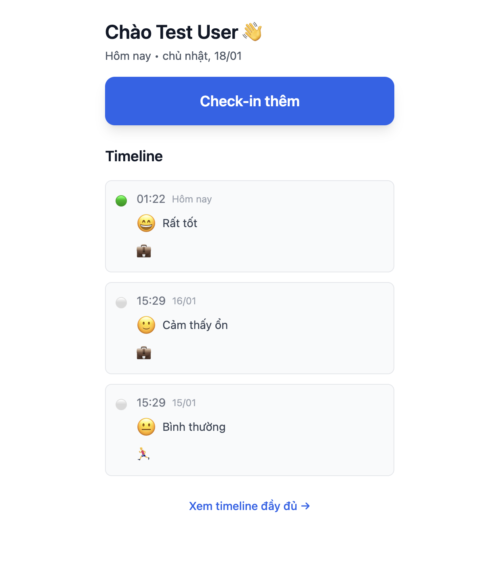
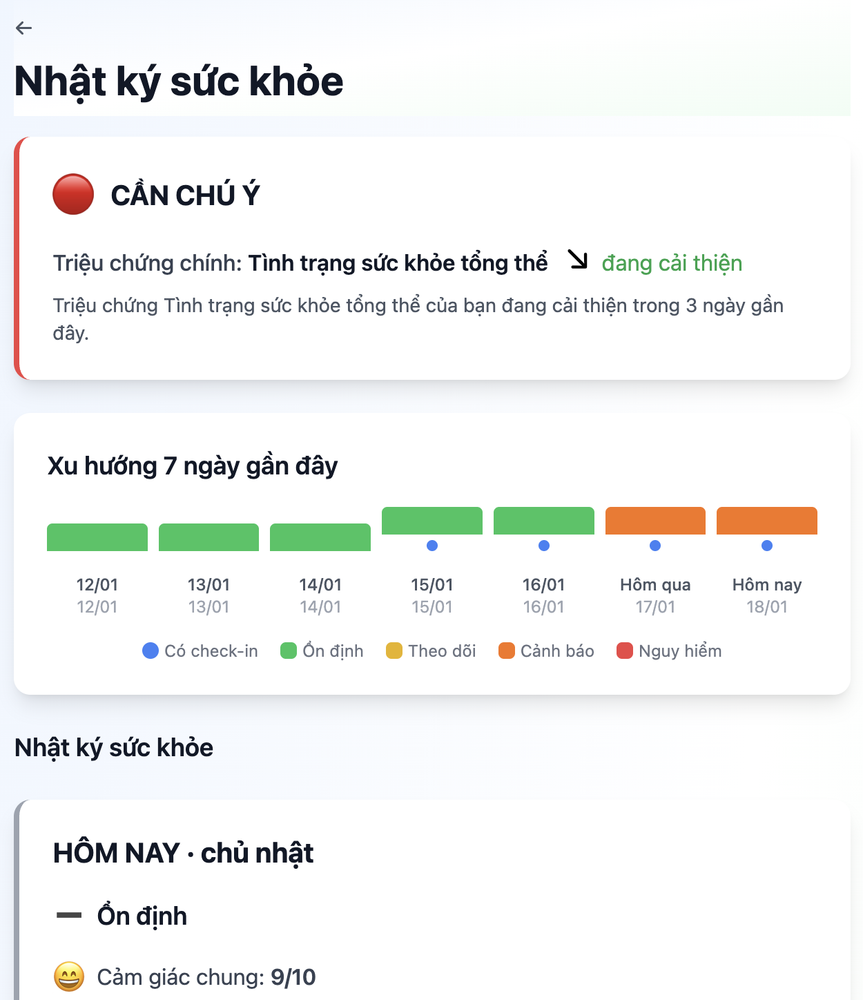

# Health Tracking System - Laravel Application

## 📸 Screenshots

### Trang chủ - Check-in và Timeline

*Giao diện trang chủ với tính năng check-in và timeline hiển thị lịch sử sức khỏe*

### Nhật ký sức khỏe - Insights và Xu hướng

*Trang nhật ký sức khỏe với insights thông minh và biểu đồ xu hướng 7 ngày*

## 📋 Tổng quan hệ thống (System Overview)

Hệ thống theo dõi sức khỏe cá nhân (Health Tracking System) là một ứng dụng web giúp người dùng:

- **Theo dõi triệu chứng sức khỏe** theo thời gian thực
- **Check-in hàng ngày** để ghi nhận tình trạng sức khỏe
- **Nhận cảnh báo sớm** dựa trên các quy tắc y tế được định nghĩa
- **Xem timeline** các sự kiện sức khỏe một cách trực quan
- **Nhận insights** thông minh về xu hướng sức khỏe
- **Quản lý thuốc** và lịch sử dùng thuốc

### Đối tượng sử dụng

- Người đang điều trị bệnh mạn tính (viêm mũi dị ứng - AR, viêm da cơ địa - AD)
- Phụ nữ mang thai cần theo dõi sức khỏe
- Người sau tiêm vaccine hoặc phẫu thuật
- Người có bệnh nền cần theo dõi triệu chứng phụ

## 🎯 Tính năng chính (Key Features)

### 1. Daily Check-in (Check-in hàng ngày)
- Ghi nhận tình trạng sức khỏe tổng thể (mood, overall feeling)
- Log các triệu chứng với mức độ nghiêm trọng
- Ghi chú và tags tùy chỉnh
- Hỗ trợ quick check-in nhanh

### 2. Moment Check-in (Check-in tức thời)
- Ghi nhận triệu chứng tại thời điểm cụ thể
- Không giới hạn số lần check-in trong ngày

### 3. Timeline View (Xem dòng thời gian)
- Hiển thị tất cả sự kiện sức khỏe theo thời gian
- Bao gồm: triệu chứng, thuốc, sự kiện y tế, alerts, insights
- Filter và tìm kiếm theo loại sự kiện

### 4. Alert System (Hệ thống cảnh báo)
- Rule-based alerts dựa trên triệu chứng và patterns
- Cảnh báo sớm khi phát hiện dấu hiệu bất thường
- Hỗ trợ acknowledgment của user

### 5. Insight Engine (Công cụ phân tích)
- Phân tích xu hướng triệu chứng (improving/worsening/stable)
- Phát hiện patterns theo thời gian
- Giải thích insights với ngữ cảnh y tế
- Tùy chỉnh theo loại bệnh (AR, AD, Pregnancy)

### 6. Medication Management (Quản lý thuốc)
- Theo dõi danh sách thuốc đang dùng
- Log lịch sử dùng thuốc
- Tích hợp vào timeline

### 7. Knowledge Base (Cơ sở kiến thức)
- Thông tin về các triệu chứng
- Hướng dẫn y tế ngắn gọn
- Tích hợp với timeline để hiển thị kiến thức liên quan

## 🛠 Tech Stack

### Backend
- **PHP**: 8.3.25
- **Laravel Framework**: 12.47.0
- **Database**: SQLite (development) / PostgreSQL (production)
- **Authentication**: Laravel Sanctum (API tokens)

### Frontend
- **Blade Templates**: Server-side rendering
- **Tailwind CSS**: 4.0.0
- **Vite**: 7.0.7 (Build tool)
- **JavaScript**: Vanilla JS với Alpine.js patterns

### Development Tools
- **Laravel Pint**: Code formatting
- **PHPUnit**: 11.5.48 (Testing)
- **Laravel Sail**: Docker development environment
- **Laravel Boost**: MCP server for AI-assisted development

## 📦 Cài đặt cho Developer (Installation)

### Yêu cầu hệ thống

- PHP >= 8.2
- Composer
- Node.js >= 18.x và npm
- SQLite (mặc định) hoặc PostgreSQL
- Git

### Bước 1: Clone repository

```bash
git clone <repository-url>
cd laravel-testai
```

### Bước 2: Cài đặt dependencies

```bash
# Cài đặt PHP dependencies
composer install

# Cài đặt Node.js dependencies
npm install
```

### Bước 3: Cấu hình môi trường

```bash
# Copy file environment
cp .env.example .env

# Generate application key
php artisan key:generate
```

Chỉnh sửa file `.env` nếu cần:
- `DB_CONNECTION`: Mặc định là `sqlite` (không cần cấu hình thêm)
- Để dùng PostgreSQL, đổi `DB_CONNECTION=pgsql` và cấu hình `DB_DATABASE`, `DB_USERNAME`, `DB_PASSWORD`

### Bước 4: Tạo database và chạy migrations

```bash
# Nếu dùng SQLite (mặc định), file database sẽ tự động được tạo
# Nếu dùng PostgreSQL, tạo database trước:
# createdb laravel_testai

# Chạy migrations
php artisan migrate

# Seed dữ liệu mẫu (symptoms, medications, alert rules)
php artisan db:seed
```

### Bước 5: Build frontend assets

```bash
# Development mode (watch mode)
npm run dev

# Hoặc build production
npm run build
```

### Bước 6: Chạy ứng dụng

```bash
# Chạy development server
php artisan serve

# Ứng dụng sẽ chạy tại: http://localhost:8000
```

### Sử dụng Laravel Sail (Docker - Tùy chọn)

Nếu muốn dùng Docker:

```bash
# Build và start containers
./vendor/bin/sail up -d

# Chạy migrations
./vendor/bin/sail artisan migrate

# Seed database
./vendor/bin/sail artisan db:seed

# Access tại: http://localhost
```

## 🚀 Development Workflow

### Chạy development server với tất cả services

```bash
# Chạy server, queue, logs, và vite cùng lúc
composer run dev
```

Lệnh này sẽ chạy:
- Laravel development server
- Queue worker
- Laravel Pail (log viewer)
- Vite dev server

### Chạy tests

```bash
# Chạy tất cả tests
php artisan test --compact

# Chạy tests trong một file cụ thể
php artisan test --compact tests/Feature/ExampleTest.php

# Chạy test với filter
php artisan test --compact --filter=testName
```

### Code formatting

```bash
# Format code theo Laravel Pint standards
vendor/bin/pint --dirty
```

### Tạo user test

Sau khi seed database, bạn có thể đăng nhập với:
- **Email**: `test@example.com`
- **Password**: `password` (mặc định từ factory)

Hoặc tạo user mới qua form đăng ký tại `/register`

## 📁 Cấu trúc dự án (Project Structure)

```
laravel-testai/
├── app/
│   ├── Http/
│   │   ├── Controllers/        # Controllers (Web & API)
│   │   └── Requests/           # Form Request validation
│   ├── Models/                  # Eloquent models
│   ├── Services/                # Business logic services
│   │   ├── CheckInService.php
│   │   ├── InsightService.php
│   │   ├── RuleEngineService.php
│   │   ├── TimelineService.php
│   │   └── NotificationService.php
│   └── Providers/              # Service providers
├── database/
│   ├── factories/              # Model factories
│   ├── migrations/             # Database migrations
│   └── seeders/                # Database seeders
├── resources/
│   ├── views/                  # Blade templates
│   ├── css/                    # Stylesheets
│   └── js/                     # JavaScript files
├── routes/
│   ├── web.php                 # Web routes
│   └── api.php                 # API routes
└── tests/                      # PHPUnit tests
```

## 🔑 Các Models chính

- **User**: Người dùng với thông tin sức khỏe (age, gender, conditions)
- **DailyCheckin**: Check-in hàng ngày (1 lần/ngày)
- **MomentCheckin**: Check-in tức thời (không giới hạn)
- **SymptomLog**: Log triệu chứng
- **MedicationLog**: Log thuốc đã dùng
- **HealthEvent**: Sự kiện y tế (tiêm, khám, test)
- **Alert**: Cảnh báo từ rule engine
- **AlertRule**: Quy tắc cảnh báo
- **Insight**: Insights được generate tự động
- **TimelineEvent**: Sự kiện hiển thị trên timeline

## 📚 API Endpoints

Tất cả API endpoints yêu cầu authentication qua Sanctum:

- `GET /api/user` - Thông tin user hiện tại
- `GET /api/checkins` - Danh sách check-ins
- `POST /api/checkins` - Tạo daily check-in
- `POST /api/checkins/moment` - Tạo moment check-in
- `GET /api/timeline` - Lấy timeline events
- `GET /api/alerts` - Danh sách alerts
- `GET /api/alerts/unacknowledged-count` - Số alerts chưa xác nhận
- `POST /api/alerts/{id}/acknowledge` - Xác nhận alert
- `GET /api/knowledge` - Danh sách kiến thức
- `GET /api/knowledge/{symptomCode}` - Chi tiết kiến thức về symptom

## 🧪 Testing

Hệ thống sử dụng PHPUnit cho testing. Tests được đặt trong thư mục `tests/`:

- `tests/Feature/` - Feature tests
- `tests/Unit/` - Unit tests

Chạy tests sau mỗi lần thay đổi code để đảm bảo không có regression.

## 📝 Notes

- Database mặc định là SQLite (`database/database.sqlite`) để dễ dàng development
- Production nên sử dụng PostgreSQL
- Queue jobs được xử lý bởi `php artisan queue:listen` hoặc queue worker
- Logs được lưu tại `storage/logs/laravel.log`

## 🤝 Contributing

Khi contribute code:

1. Chạy tests trước khi commit
2. Format code với Laravel Pint: `vendor/bin/pint --dirty`
3. Follow Laravel coding standards
4. Viết tests cho tính năng mới

## 📄 License

The Laravel framework is open-sourced software licensed under the [MIT license](https://opensource.org/licenses/MIT).
